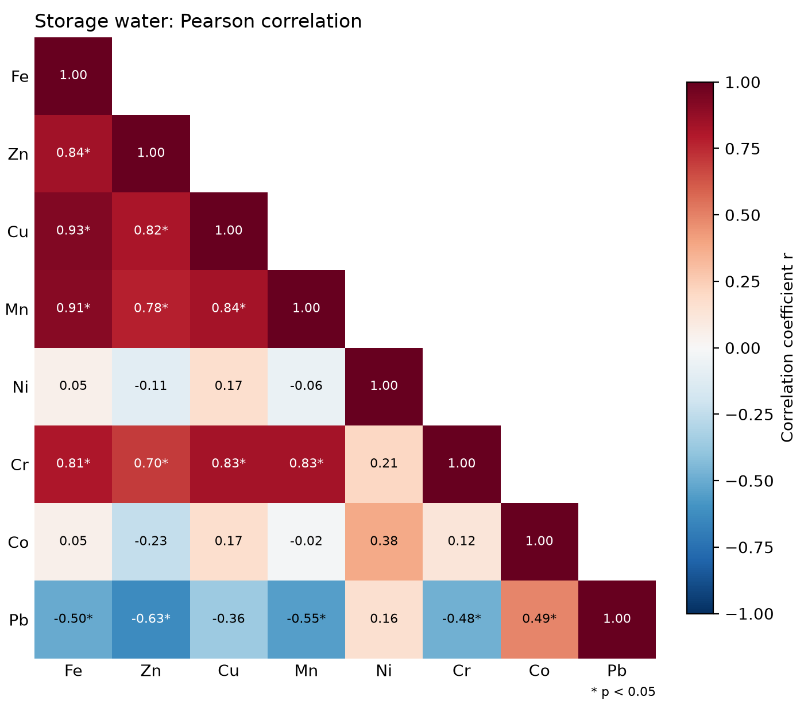
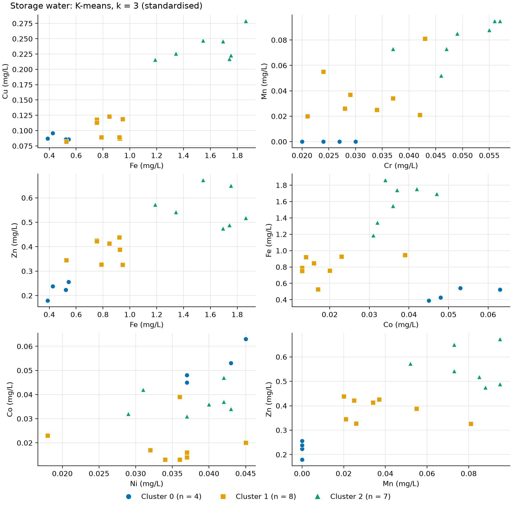
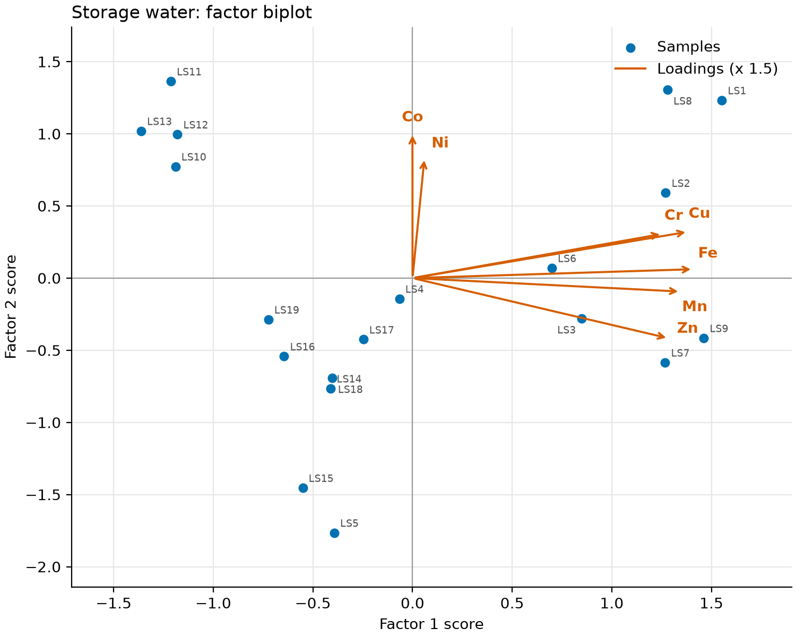

# water-quality-analysis

[](https://github.com/Jubemi-Pajiah/water-quality-analysis/actions/workflows/ci.yml)

A small Python package (`wqtools`) for heavy metal data in drinking water. It computes the Water Quality Index (WQI) and the Water Pollution Index (WPI), and runs a standard multivariate workflow: Pearson correlation, K-means with elbow and silhouette checks, factor analysis with KMO and Bartlett tests, and dendrograms of samples and metals. It ships with the 38 samples (19 borehole wellhead, 19 storage tank) from Edegbai et al. (2026), so every figure and table below can be regenerated with one command.

## Sample figures



*Pearson correlation between metals in the 19 storage water samples. Asterisks mark p < 0.05. Cd is left out because it was below detection in every sample.*



*K-means on standardised concentrations of seven metals, k = 3 (highest silhouette score). Cluster 0 has the lowest mean Fe.*



*Two-factor solution with varimax rotation. Points are sample scores, arrows are loadings (scaled together so they fit the plot).*

## Quick start

```bash
git clone https://github.com/Jubemi-Pajiah/water-quality-analysis.git && cd water-quality-analysis
pip install -r requirements.txt
python -m wqtools all
```

This writes `outputs/groundwater/` and `outputs/storage_water/`: PNG figures at 200 dpi and CSV tables. Run `pytest` to check the installation. Python 3.11 is tested in CI.

Each analysis can also be run on its own and on your own data:

```bash
python -m wqtools wqi     --data my_samples.xlsx --sheet GroundWater --standards my_limits.csv --out results
python -m wqtools cluster --data my_samples.csv --k 3 --no-scale --out results
```

Subcommands: `all`, `wqi`, `wpi`, `corr`, `cluster`, `factor`, `dendro`. Options: `--data`, `--sheet`, `--standards`, `--standards-sheet`, `--out`, `--no-scale`, `--label`, and `--k` for `cluster`. A sample table needs a `Sample ID` column and one numeric column per parameter. A standards table needs `Parameter` and `Permissible Limit (Si)`; `Ideal Value (Ci)` is optional and defaults to 0.

## What is inside

| Analysis | Function | Output |
| --- | --- | --- |
| Load and check data | `io.load_samples`, `io.load_standards`, `io.drop_constant` | |
| Water Quality Index | `indices.wqi`, `indices.wqi_class` | `wqi.csv`, `wqi.png` |
| Water Pollution Index | `indices.wpi` | `wpi.csv`, `wpi.png` |
| Correlation with p-values | `stats.correlation_matrix` | `correlation_r.csv`, `correlation_p.csv`, `correlation.png` |
| Choice of k | `stats.elbow_wcss`, `stats.elbow_k`, `stats.silhouette_by_k` | `cluster_selection.csv`, `elbow.png`, `silhouette.png` |
| K-means | `stats.kmeans_clusters`, `stats.cluster_summary` | `cluster_labels.csv`, `cluster_means.csv`, `clusters.png` |
| Factor analysis | `stats.factor_suitability`, `stats.factor_eigenvalues`, `stats.factor_loadings` | `factor_*.csv`, `scree.png`, `loadings.png`, `biplot.png` |
| Hierarchical clustering | `plots.sample_dendrogram`, `plots.variable_dendrogram` | `dendrogram_samples.png`, `dendrogram_metals.png` |

The package is `wqtools/` (`io.py`, `indices.py`, `stats.py`, `plots.py`, and the command line in `__main__.py`). Tests are in `tests/`. The original one-off scripts are kept unchanged in `legacy/` for reference.

## Methods

**WQI (weighted arithmetic).** For each parameter with permissible limit Si and ideal value Vi, the unit weight is Wi = K / Si with K = 1 / sum(1 / Si), and the quality rating of a measured value Va is

    Qi = 100 * (Va - Vi) / (Si - Vi)

For pH the rating is two-sided around neutral: Qi = 100 * (pH - 7) / (8.5 - 7) at or above 7, and 100 * (7 - pH) / (7 - 6.5) below 7. The index is WQI = sum(Qi * Wi) / sum(Wi), taken for each sample over the parameters that have a value, so the weights renormalise when a value is missing. `wqi_class` uses the bands below 50 excellent, 50 to 100 good, 100 to 200 poor, 200 to 300 very poor, and 300 or more unsuitable.

**WPI.** For each parameter the pollution load is PL = 1 + (C - Si) / Si, where C is the measured value, and WPI is the mean PL across parameters. For pH, PL = (7 - pH) / (7 - 6.5) below 7 and (pH - 7) / (8.5 - 7) above 7. A value of exactly 0 is treated as not detected and left out of the mean; `n_parameters` records how many parameters each sample used. A WPI above 1 means the average parameter is above its limit.

**Zeros.** Values below detection are stored as 0. The two indices treat them differently, following the original analysis: WPI skips them, while WQI keeps them as Qi = 0. Because WQI weights are proportional to 1/Si, the metals with the strictest limits (Cd and Pb here) carry the largest weights, so a zero for them pulls the WQI down strongly. See Limitations.

**Standardisation.** K-means, the sample dendrogram and factor analysis work on standardised concentrations (zero mean, unit variance per metal). Fe concentrations are several times to about fifty times those of the other metals, so without scaling the Euclidean distance is almost entirely Fe. `--no-scale` reproduces the original unscaled K-means. K-means uses `random_state=42` and `n_init=10`, and the clusters are renumbered so that cluster 0 has the lowest mean Fe. The number of clusters defaults to the k with the highest mean silhouette score (k = 2 to 10); the elbow is reported as the point of the WCSS curve furthest from the line joining its ends.

**Variables used.** Correlation uses every metal that varies. K-means, factor analysis and both dendrograms use Fe, Zn, Cu, Mn, Ni, Cr and Co. Cd is below detection in every sample and Pb is detected in only 4 of 19 samples in each dataset, too few to support a multivariate model. Any column that is constant is dropped automatically and reported.

**Factor analysis.** Suitability is checked with the Kaiser-Meyer-Olkin measure (KMO, from 0 to 1, values above about 0.6 are usually considered adequate) and Bartlett's test of sphericity (a small p-value means the correlation matrix is not an identity matrix). Two factors are extracted by minimum residual from the correlation matrix and rotated with varimax, which keeps the factors uncorrelated while pushing each loading towards 0 or towards a large value, so each factor is easier to read. Because the sign of a factor is arbitrary, each factor is oriented so that its largest loading is positive.

**Dendrograms.** Samples: Ward linkage on standardised concentrations (Euclidean distance). Metals: average linkage on the distance 1 - r, where r is the Pearson correlation.

## Results on the bundled data

These describe what the outputs show. They are statistical patterns, not source attribution.

**Indices.** With the limits in `data/standards.csv` (Co has no limit and is not used), groundwater WQI ranges from 3.7 to 80.6 and storage water WQI from 5.1 to 220.3. The highest values in both sets are the four samples where Pb was detected (US10 to US13 and LS10 to LS13). WPI ranges from 0.39 to 1.32 in groundwater (1 sample above 1) and from 0.54 to 2.10 in storage water (8 samples above 1). Fe is above its limit in all 38 samples. These metals-only indices are not the same as the indices in Edegbai et al. (2026), which also included pH, EC, TDS and microbiological counts.

**Correlation.** In storage water, Fe, Zn, Cu, Mn and Cr are strongly and significantly correlated with each other (r = 0.70 to 0.93). In groundwater the same group is correlated more weakly (r = 0.19 to 0.74, most pairs significant). Ni and Co show little correlation with that group in either dataset.

**Clusters.** In storage water the elbow and the silhouette score agree on k = 3 (silhouette 0.47). The clusters largely follow Fe: LS10 to LS13 (lowest Fe, Mn below detection), LS4, LS5 and LS14 to LS19, and LS1 to LS3 with LS6 to LS9 (highest Fe). In groundwater there is no clear choice: the elbow is at k = 5 and the silhouette score peaks at k = 6 with a low value of 0.32, and two of the six clusters contain a single sample. The groundwater clustering should be read as weak structure. On unscaled data both datasets give k = 2, driven by Fe.

**Factor analysis.** Storage water: KMO = 0.76, Bartlett p < 0.001. Two factors explain 74% of the variance. Factor 1 loads on Fe, Cu, Mn, Zn and Cr (0.86 to 0.96) and Factor 2 on Co (0.69) and Ni (0.57). Groundwater: KMO = 0.54, below the usual threshold, Bartlett p < 0.001. Two factors explain 60% of the variance. Factor 1 loads on Cu, Mn, Cr and Fe (0.70 to 0.90), and Factor 2 moderately on Zn, Co and Ni (about 0.5). Mn has a communality slightly above 1 (1.01), a Heywood case, which is another sign that the groundwater factor model is not well determined.

## Limitations

- **Small sample.** Each dataset has 19 samples and 7 variables in the multivariate models. That is small for factor analysis, where common guidance asks for many more observations per variable. The groundwater KMO of 0.54 and the Heywood case confirm this. Treat the factor results as descriptive.
- **Pb and Cd.** Cd was never detected and Pb only in 4 samples per dataset, so neither can be analysed statistically. Pb is still shown in the correlation matrix, where its coefficients rest on those 4 values.
- **Zeros in the WQI.** Below-detection values count as a rating of 0 on the parameters with the largest weights. If Pb and Cd zeros were treated as missing instead, groundwater WQI would range from about 42 to 271 rather than 3.7 to 81. The WQI is therefore very sensitive to how non-detects are handled, and to which parameters are in the limits file.
- **Limits.** Both indices depend entirely on `data/standards.csv`. Other standards will give different values and classes.
- **Correlation is not attribution.** Co-varying metals may share a source, but correlation and factor analysis cannot show which source.
- **Single survey.** The data come from one sampling campaign, with no seasonal repeat.

## Data and standards

`data/groundwater_metals.csv` (samples US1 to US19, borehole wellheads) and `data/storagewater_metals.csv` (LS1 to LS19, overhead storage tanks) hold the Fe, Zn, Cu, Mn, Ni, Cr, Co, Pb and Cd concentrations in mg/L reported in Table 3 of Edegbai et al. (2026). The sample codes are the codes used in the paper, and sample *n* in one file is the paired location of sample *n* in the other. The samples were collected on and around the University of Benin campus, Benin City, Nigeria, and analysed by atomic absorption spectrometry. Values reported as below detection (BDL) are entered as 0. The paper also reports pH, EC, TDS, salinity and microbiology; those are not included here.

`data/standards.csv` holds the permissible limits used by both indices, taken from the limits row of Table 3 in the same paper: Fe 0.3, Zn 3, Cu 2, Mn 0.4, Ni 0.07, Cr 0.05, Pb 0.01 and Cd 0.003 mg/L. That row gives no limit for Co, so Co is not part of either index. Replace the file to use another standard.

## How to cite

If you use the data, please cite the paper:

> Edegbai, A. J., Pajiah, J. A., Egbuchunam, D. A., Iyeke, M. U., Omietimi, E. J., and Lenhardt, N. (2026). Assessment of groundwater and storage water quality contamination at the University of Benin campus, Southern Nigeria. *Discover Water*, 6, 58. https://doi.org/10.1007/s43832-026-00379-2

If you use the code, please cite this repository:

> Pajiah, J. (2026). water-quality-analysis: water quality indices and multivariate analysis of heavy metal data. https://github.com/Jubemi-Pajiah/water-quality-analysis

## Licence

The code is released under the MIT licence, see [LICENSE](LICENSE).

## Contact

Jubemi Pajiah, info@jubemi.com, [jubemi.com](https://jubemi.com)
